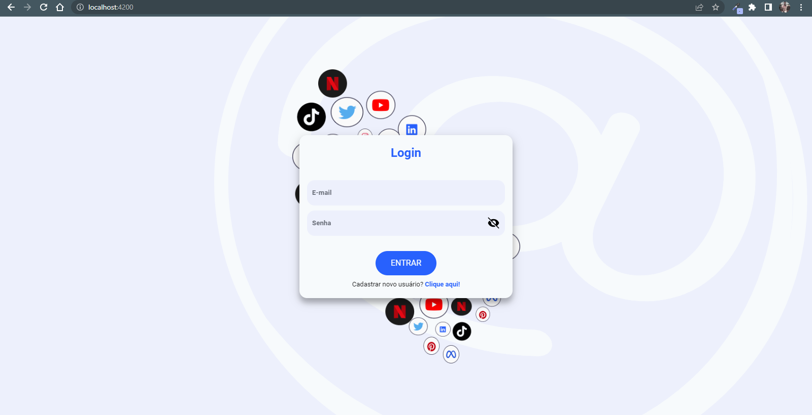
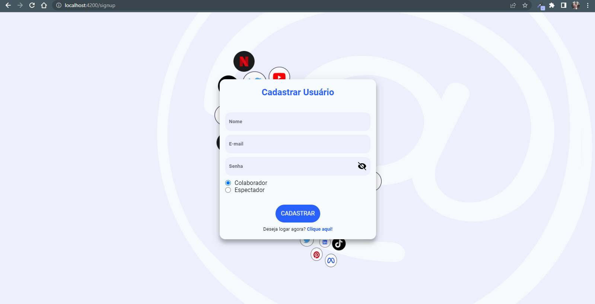
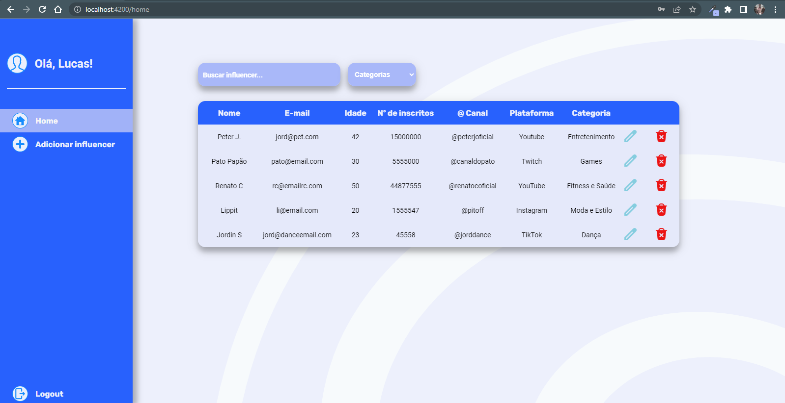
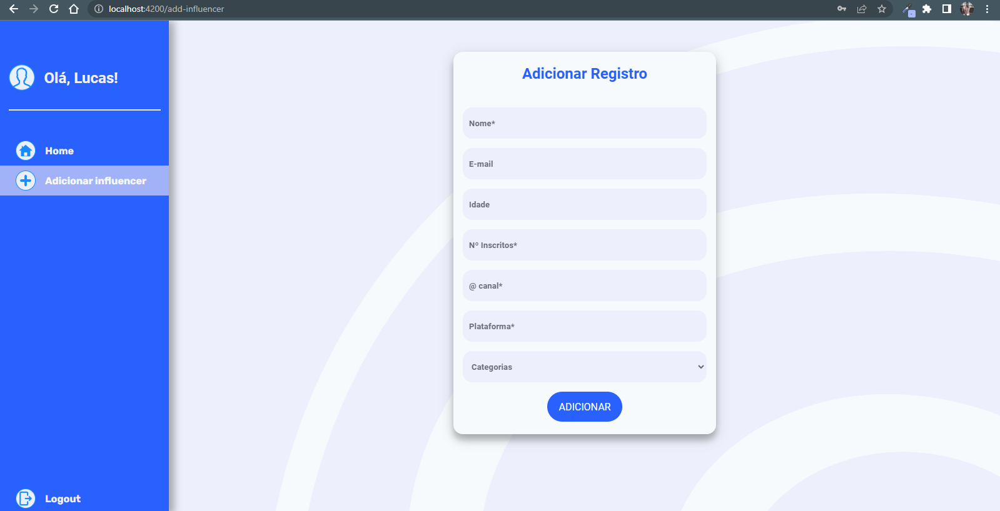
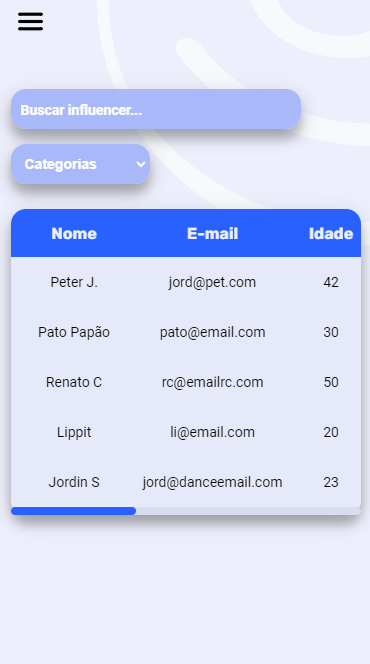
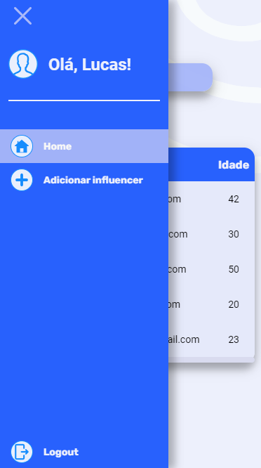
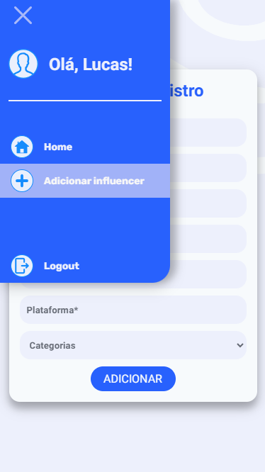

# projeto-Influencer-Hub

<h1>Projeto Influencer Hub</h1>

<h2 style="font-family: sans-serif;">Sobre o projeto:</h2>

  Esse projeto faz parte de um desafio de Desenvolvimento Front-End e Back-End. Tal desafio consistia na criação de um painel de controle (Dashboard) para gerenciar dados de Influenciadores dígitais (Influencers)

O projeto conta com uma API desenvolvida com Express e um layout produzido em Angular.js.

<h2 style="font-family: sans-serif;">Objetivo do Projeto Influencer Hub:</h2>

O objetivo do projeto consiste em criar uma aplicação de gerenciamento de informações de influenciadores. Nele é possível cadastrar, editar e apagar dados sendo uma ferramenta. Além disso é possível vizualizar informações dos influenciadores cadastrados, como nome, e-mail de contato, @ do canal, plataformas utilizadas  e categorias de conteúdo

As rotas de cadastro, edição e exclusão de influencers são protegidas por autenticação e o usuário responsável pelo aplicativo deverá cadastrar novos usuários dando-lhes autorização e autenticação através da senha e token gerado pela aplicação. Para mais informações acesse a <a href="https://github.com/LucasOliveria/Api-Projeto-Influencer-Hub" target="_blank">Documentação da API</a> 

<h2 style="font-family: sans-serif;">Como utilizar os códigos desse repositório:</h2>

    Caso queira utilizar o código presente nesse repositório basta cloná-lo para sua máquina e utilizar o comando npm install no terminal do seu Editor de código para instalar node_modules e suas dependências. Após isso você poderá rodar a aplicação utilizando o comando ng serve.

<h2 style="font-family: sans-serif;">Documentação da API:</h2>

O repositório contendo os códigos da API desenvolvida para esse projeto assim como sua documentação pode ser acessada clicando <a href="https://github.com/LucasOliveria/Api-Projeto-Influencer-Hub" target="_blank">AQUI</a>.

<h2 style="font-family: sans-serif;">Link da aplicação:</h2>

O site da aplicação pode ser acessaro por esse link:<a href="https://influencer-hub-olivr.netlify.app/" target="_blank">https://influencer-hub-olivr.netlify.app/</a> 

<h2 style="font-family: sans-serif;">Linguagens, bibliotecas e frameworks utilizados:</h2>

<ul>
    <li>Angular.js</li>
    <li>TypeScript</li>
    <li>HTML</li>
    <li>CSS</li>
    <li>ngx-toastr</li>
    <li>API desenvolvida com Express</li>
</ul>

<h2 style="font-family: sans-serif;">Layout:</h2>

 

 

 

 

 

 

 

<h2 style="font-family: sans-serif;">Autor</h2>

Lucas Oliveira

<h2 style="font-family: sans-serif;">Links</h2>

<a href="http://www.linkedin.com/in/lucas-de-oliveira-5b8a5532" target="_blank">LinkedIn</a>
 
<a href="https://influencer-hub-olivr.netlify.app/" target="_blank">Site</a> 